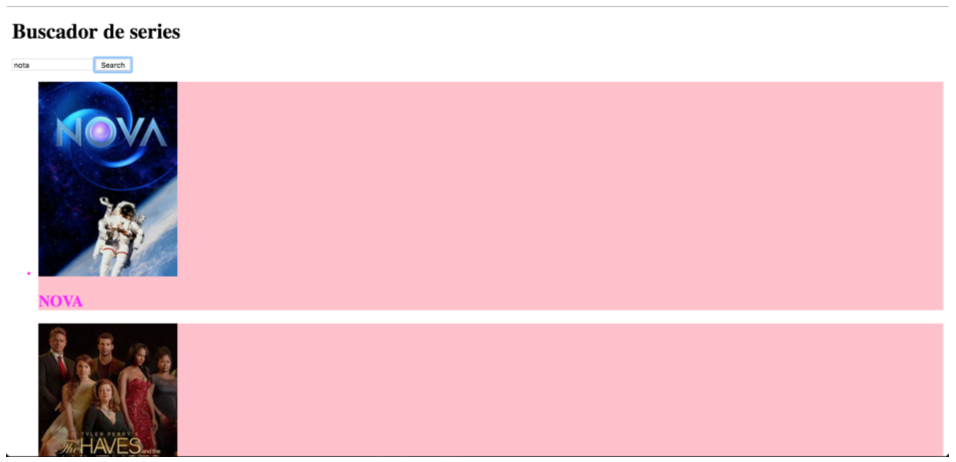

# Ejercicio de evaluación final ‒ Sprint 2 ([Adalab](https://adalab.es/))

Este repositorio contiene mi ejercicio ([@palomaviolin](https://github.com/palomaviolin)) de evaluación final del Sprint 2 de Adalab.

[AQUÍ](http://palomaviolin.github.io/e-s2-evaluacion-final-palomaviolin/) podéis encontrar el link directo a la website resultante, y a continuación pondré en detalle las instrucciones que nos dieron para realizar dicho ejercicio. Finalmente añadiré una guía para usar este repo el cual contiene un web-starter-kit en node/gulp.


# Instrucciones dadas para realizar el ejercicio:

Antes de empezar, tenéis que crear un nuevo repositorio desde GitHub Classroom usando el enlace que te hayan facilitado. Una vez creado, lo clonamos en nuestro ordenador y en la carpeta creada empezaremos a trabajar en el ejercicio.

El ejercicio consiste en desarrollar una aplicación web de búsqueda de series de TV, donde demostraremos los conocimientos de JavaScript adquiridos durante el sprint. El ejercicio también tiene una parte de maquetación con HTML y Sass, os recomendamos dedicar esfuerzo a la maquetación una vez terminada la parte de JavaScript, ya que los criterios de evaluación están relacionados con esta última.

Vamos de definir los distintos hitos del ejercicio:

## 1. Maquetación

En primer lugar vamos a realizar una maquetación básica sobre este modelo. No nos centramos en medidas, colores ni tipografía hasta un hito posterior.



La aplicación de búsqueda de series consta de dos partes:

1. Un campo de texto y un botón para buscar series por su título.
2. Un listado de resultados de búsqueda donde aparece el cartel de la serie y el título.

Para realizar la maquetación básica del ejercicio usaremos Sass y la base de gulp del [Adalab Web Starter Kit](https://github.com/Adalab/Adalab-web-starter-kit).

## 2. Búsqueda

Al hacer clic sobre el botón de 'Buscar', nuestra aplicación debe conectarse al [API abierto de TVMaze para búsqueda de series](http://www.tvmaze.com/api#show-search). Os recomendamos echar un vistazo al [JSON que devuelve una petición de búsqueda](http://api.tvmaze.com/search/shows?q=girls) para ver qué datos de los que nos devuelve necesitamos. Para construir la URL de búsqueda necesitaremos recoger el texto que ha introducido el usuario en el campo de búsqueda. Por cada show contenido en el resultado de búsqueda debemos pintar una tarjeta donde mostramos una imagen de la serie y el título.

Algunas de las series que obtenemos en los resultados no tienen cartel. En ese caso debemos mostrar una imagen de relleno. Podemos crear una imagen de relleno con el servicio de placeholder.com donde en la propia URL indicamos el tamaño, colores, texto: `https://via.placeholder.com/210x295/cccccc/666666/?text=TV`.

## 3. Favoritos

Una vez aparecen los resultados de búsqueda, podremos indicar cuáles son nuestros favoritos. Para ello, al hacer clic sobre un resultado cambia el color de fondo y se pone un borde alrededor de la tarjeta. También vamos a almacenar la información de favoritos en el localStorage. De esta forma si como resultado de búsqueda aparece una serie que hemos marcado como favorita, aparecerá directamente como favorita en el listado.

## 4. BONUS: Afinar la maquetación

Una vez terminada la parte de interacción, podemos centrarnos en la parte de maquetación para aproximarnos a la propuesta gráfica.


## 5. Criterios de evaluación

### Control de versiones

- Uso de control de versiones con ramas para nuevas funcionalidades.

### JavaScript básico

- Crear código JavaScript con sintaxis correcta, bien estructurado e indentado.
- Usar variables para almacenar información y re‒asignar valores.
- Usar condicionales para ejecutar acciones distintas en función de una condición Saber recorrer listados de datos para procesarlos.
- Usar funciones para estructurar el código.
- Saber modificar la información del DOM para añadir contenido dinámico.
- Saber escuchar eventos del DOM y actuar en consecuencia.

### AJAX y APIs
- Crear peticiones con fetch y promesas.
- Gestionar información en formato JSON.
- Usar el localStorage para guardar información en el navegador.
- Otros criterios a tener en cuenta.
- Usar inglés para nombres de variables, funciones, clases, mensajes de commit, nombres de ficheros.
- El repositorio de GitHub debe tener README y un enlace a la web en GitHub Pages accesible desde la página principal.


# Guía para usar este repositorio

Este repo es incluye un [web-starter-kit](https://github.com/Adalab/Adalab-web-starter-kit) en node/gulp.
Incluye SCSS, un sistema de plantillas HTMl y un web server.
Necesitarás instalar [Node.js](https://nodejs.org/) y [Gulp](https://gulpjs.com) para trabajar con este Starter Kit, luego:
1. Descarga o clona el repositorio
2. Instala las dependencias locales con `$ npm install`
3. Arranca el kit con `$ gulp`

## Espera, ¿esto se hace siempre?
> ### Solo una vez al principio en cada ordenador que utilicemos:
- Instalamos node
- Instalamos el comando de gulp de forma global para poder usarlo desde cualquier carpeta usando `npm install --global gulp-cli`

> ### Cada vez que descarguemos o clonemos un repo:
- `npm install` para instalar los paquetes necesarios para convertir Sass a CSS, minizarlo, etc.

> ### Cada vez que estemos trabajando con nuestro código:
- Desde nuestra terminal, ejecutamos el comando `gulp` para que realice la tarea por defecto, que en el caso del `gulpfile.js` que tenemos en adalab-web-starter-kit estará pendiente de nuestros archivos Sass, html y JavaScript y los compilará, minificará y/o recargará el servidor cada vez que hagamos un cambio

## Tareas de gulp incluidas
### Inicio de un web server para desarrollo
```
$ gulp
```
Lanza un webserver con BrowserSync y varios watchers estarán pendientes de los archivos SCSS/JS/HTML, en la carpeta **public/**, para recargar el navegador cuando se necesite.

### Versión lista para subir a producción
```
$ gulp docs
```
En la carpeta **docs/** genera los CSS y JS minimizados y sin sourcemaps listos para subir al repo y activar GitHub Pages en `master/docs`.


## Estructura del proyecto
Nuestro **gulpfile.js** usa un JSON de configuración con las rutas de los archivos a generar/vigilar.

La estructura de carpetas tiene esta pinta:
```
/
`- _src
   |- assets
   |  |- icons
   |  |- images
   |  |- js
   |  `- scss
   |     `- core
   |
   `- templates
      `- partials

```

## HTML
Viene incluído el paquete [**gulp-html-partial**](https://www.npmjs.com/package/gulp-html-partial) que nos va a permitir tener un sistema de plantillas html

## Imágenes e iconos
Tenemos en **_src/** una carpeta para las imágenes del proyecto y una para los iconos como el favicon o los iconos de dispositivos móviles. Estos últimos se generan en la raíz de las carpetas **public/** y **docs/**

## CSS
Viene incluído el paquete [**gulp-combine-mq**](https://www.npmjs.com/package/gulp-combine-mq) que agrupa todas las mediaqueries al final del documento css.

## JS
Podemos usar parciales de JS: en el JSON de configuración, **config.json** especificamos los archivos JS que utilizamos y en el orden que deben procesarse.

